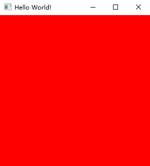

# Preparing

Before staring, we need to prepare our project. We will use Java 19 for our project.

Add the dependencies to your build script. In the future, we can use the customizer to generate the dependencies.

Also, remember to enable the preview features.

```groovy
// Groovy
project.ext.overrunglVer = "0.1.0"
project.ext.overrunglNatives = "natives-windows"
dependencies {
    implementation platform("io.github.over-run:overrungl-bom:$overrunglVer")
    implementation "io.github.over-run:overrungl"
    implementation "io.github.over-run:overrungl-glfw"
    implementation "io.github.over-run:overrungl-opengl"
    implementation "io.github.over-run:overrungl-stb"
    runtimeOnly "io.github.over-run:overrungl-glfw::$overrungNatives"
    runtimeOnly "io.github.over-run:overrungl-stb::$overrungNatives"
}
tasks.withType(JavaCompile).configureEach {
    options.compilerArgs += "--enable-preview"
}
// Kotlin DSL Script
val overrunglVer = "0.1.0"
dependencies {
    implementation(platform("io.github.over-run:overrungl-bom:$overrunglVer"))
    implementation("io.github.over-run:overrungl")
    implementation("io.github.over-run:overrungl-glfw")
    implementation("io.github.over-run:overrungl-opengl")
    implementation("io.github.over-run:overrungl-stb")
    runtimeOnly("io.github.over-run", "overrungl-glfw", classifier = overrungNatives)
    runtimeOnly("io.github.over-run", "overrungl-stb", classifier = overrungNatives)
}
tasks.withType<JavaCompile> {
    options.compilerArgs.add("--enable-preview")
}
```

If you had used LWJGL before, you may see that the there is no native for core and OpenGL module.
This because the OpenGL module used core and GLFW module to load functions,
and we don't have to build shared libraries for it.

To get started with OverrunGL, we use [this example](https://github.com/Over-Run/overrungl/wiki/Getting-Started).
You can see we are using GLFW for our window, so we can interact with mouse, keyboard even controllers.

If all works, you will get a red window like this below.


